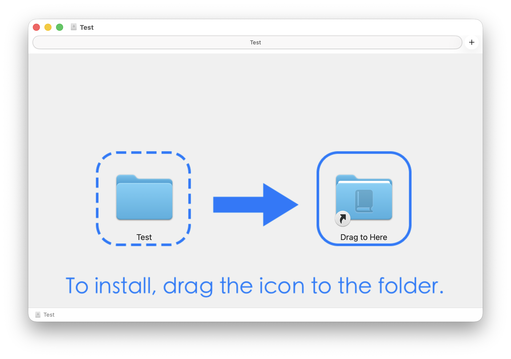

# DMG Maker



A simple and elegant bash script to create customized macOS DMG installers with background images for various file types including `.dictionary`, `.app`, `.qlgenerator`, and more.

## Features

- **Automated Installation Path**: Automatically creates a symlink to the appropriate system folder (e.g., `/Applications` for apps, `~/Library/Dictionaries` for dictionaries).
- **Custom Aesthetics**: Supports custom background images and precise icon positioning.
- **Support for Multiple Types**: Handles `.dictionary`, `.app`, `.qlgenerator`, `.plugin`, `.bundle`, and generic folders.

## Prerequisites

This script requires [create-dmg](https://github.com/create-dmg/create-dmg). If you don't have it, the script will attempt to install it via Homebrew:

```bash
brew install create-dmg
```

## Usage

1. **Clone the repository**:
   ```bash
   git clone https://github.com/your-username/dmg-maker.git
   cd dmg-maker
   ```

2. **Run the script**:
   ```bash
   ./dmg.sh "path/to/your/content" "path/to/background.png"
   ```

   Example for a dictionary:
   ```bash
   ./dmg.sh MyDictionary.dictionary Background.png
   ```

## Customization

You can modify the following parameters in `dmg.sh` to fit your background design:

- `--window-size`: Dimensions of the DMG window.
- `--icon-size`: Size of the icons.
- `--icon "NAME" X Y`: Position of the source item and the "Drag to Here" symlink.

## Background Resolution Tip

For best results, ensure your background image is set to **72 DPI** or **144 DPI (Retina)**. High DPI settings (like 300 or 600) may cause the background to appear incorrectly in Finder. You can fix this using:

```bash
sips -s dpiHeight 72 -s dpiWidth 72 Background.png
```

## License

This project is licensed under the MIT License - see the LICENSE file for details.
